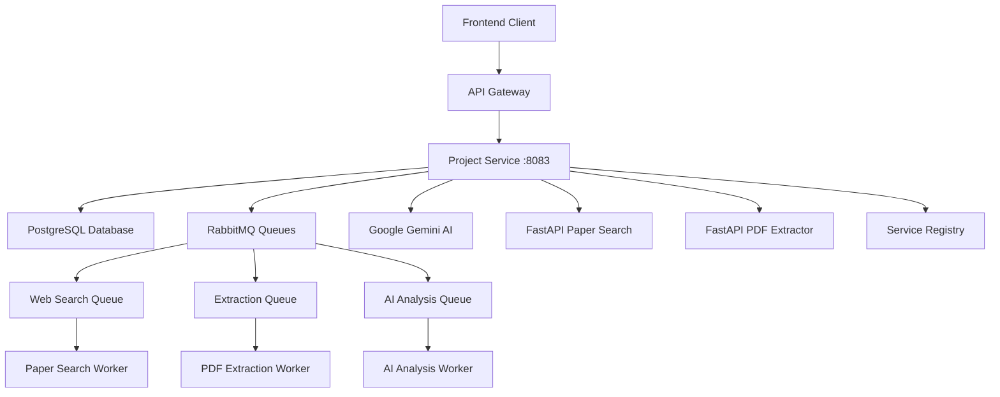
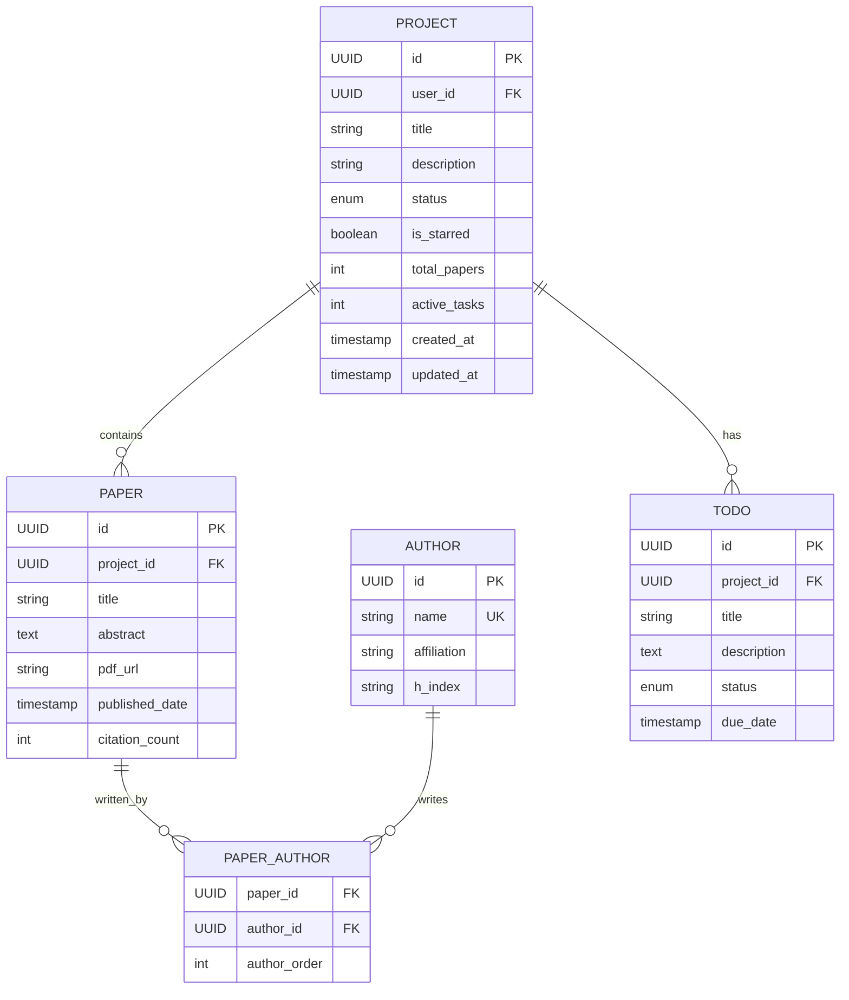

<div align="center">
  <h1>🎓 ScholarAI Project Service</h1>
  <p><strong>Academic Research Project Management Microservice</strong></p>
  
  [](https://spring.io/projects/spring-boot)
  [](https://www.postgresql.org/)
  [](https://www.rabbitmq.com/)
  [](https://ai.google.dev/)

  <p>Comprehensive project management service for academic research workflows. Features AI-powered analysis, paper management, LaTeX processing, and collaborative research tools.</p>

  [Quick Start](#-quick-start) · [API Documentation](#-api-endpoints) · [AI Features](#-ai-powered-features) · [Architecture](#-architecture)
</div>

---

## ✨ **Core Features**

### 📋 **Project Management**
- **Research Projects**: Create, update, and manage academic research projects
- **Project Statistics**: Track project progress, paper counts, and completion metrics
- **Status Management**: Active, paused, completed, and archived project states
- **Collaboration**: Multi-user project access and collaboration features
- **Project Notes**: Integrated note-taking and documentation system

### 📚 **Paper & Library Management**
- **Paper Library**: Centralized repository for research papers and documents
- **Web Search Integration**: Automated paper discovery via external search APIs
- **Paper Upload**: Manual paper upload and metadata management
- **Reading Lists**: Organized reading lists with progress tracking
- **Citation Management**: Author information and citation tracking

### 🤖 **AI-Powered Features**
- **Abstract Analysis**: AI-powered abstract highlighting and keyword extraction
- **Scholar Bot**: Intelligent research assistant with chat interface
- **Paper Recommendations**: AI-driven paper discovery and recommendations
- **Research Gap Analysis**: Identify research opportunities and gaps
- **Content Summarization**: Automated paper and abstract summarization

### 📄 **Document Processing**
- **LaTeX Support**: Full LaTeX document processing and compilation
- **PDF Extraction**: Automated text and metadata extraction from PDFs
- **Format Conversion**: Convert between various academic document formats
- **Template Management**: LaTeX templates and document generation

### 🔄 **Integration & Messaging**
- **RabbitMQ Integration**: Asynchronous message processing for long-running tasks
- **FastAPI Integration**: External Python services for specialized processing
- **Service Discovery**: Eureka client for microservice communication
- **Event-Driven Architecture**: Decoupled service communication

---

## 🚀 **Quick Start**

### Prerequisites
- **Java 21+** (OpenJDK recommended)
- **Maven 3.8+** for building
- **PostgreSQL 15+** for data persistence
- **RabbitMQ 3.11+** for message queuing
- **LaTeX Distribution** (TeX Live) for document processing
- **FastAPI Services** for paper search and extraction
- **Service Registry** running on port 8761

### 🛠️ **Local Development**

1. **Clone and Build**
   ```bash
   git clone https://github.com/Javafest2025/project-service.git
   cd project-service
   ./mvnw clean install
   ```

2. **Database Setup**
   ```bash
   # Create PostgreSQL database
   createdb projectDB
   
   # Or using Docker
   docker run --name project-postgres \
     -e POSTGRES_DB=projectDB \
     -e POSTGRES_USER=project_user \
     -e POSTGRES_PASSWORD=project_pass \
     -p 5432:5432 -d postgres:15
   ```

3. **RabbitMQ Setup**
   ```bash
   # Using Docker
   docker run --name project-rabbitmq \
     -e RABBITMQ_DEFAULT_USER=rabbit_user \
     -e RABBITMQ_DEFAULT_PASS=rabbit_pass \
     -p 5672:5672 -p 15672:15672 \
     -d rabbitmq:3-management
   ```

4. **LaTeX Installation**
   ```bash
   # Ubuntu/Debian
   sudo apt-get install texlive-full pandoc
   
   # macOS
   brew install --cask mactex
   brew install pandoc
   
   # Windows
   # Download and install MiKTeX + Pandoc
   ```

5. **Environment Configuration**
   ```bash
   cp env.example .env
   ```
   
   Configure your `.env` file:
   ```env
   # Database
   PROJECT_DB_USER=project_user
   PROJECT_DB_PASSWORD=project_pass
   
   # RabbitMQ
   RABBITMQ_USER=rabbit_user
   RABBITMQ_PASSWORD=rabbit_pass
   
   # AI Services
   GOOGLE_GEMINI_API_KEY=your-gemini-api-key
   
   # FastAPI Services
   FASTAPI_PAPERSEARCH_URL=http://localhost:8001
   FASTAPI_EXTRACTOR_URL=http://localhost:8002
   
   # Service Discovery
   EUREKA_CLIENT_SERVICEURL_DEFAULTZONE=http://localhost:8761/eureka/
   ```

6. **Run the Service**
   ```bash
   ./mvnw spring-boot:run -Dspring-boot.run.profiles=local
   ```
   
   🌐 **Service Health:** `http://localhost:8083/actuator/health`
   📚 **API Documentation:** `http://localhost:8083/docs`

### 🐳 **Docker Deployment**

#### Using Docker Compose (Recommended)
```bash
# Start project service with dependencies
docker-compose up -d

# View logs
docker-compose logs -f project-service

# Stop services
docker-compose down
```

#### Using Docker Scripts
```bash
# Build and start
./scripts/docker.sh up

# View logs
./scripts/docker.sh logs

# Check health
./scripts/docker.sh health

# Stop service
./scripts/docker.sh stop
```

#### Manual Docker Commands
```bash
# Build image
docker build -t scholar-project-service .

# Run with dependencies
docker run -d --name scholar-project-service \
  -p 8083:8083 \
  -e SPRING_PROFILES_ACTIVE=docker \
  -e PROJECT_DB_USER=project_user \
  -e PROJECT_DB_PASSWORD=project_pass \
  -e RABBITMQ_USER=rabbit_user \
  -e RABBITMQ_PASSWORD=rabbit_pass \
  -e GOOGLE_GEMINI_API_KEY=your-api-key \
  --network scholarai-network \
  scholar-project-service
```

---

## 🏗️ **Architecture**

### 🔄 **Service Integration Flow**



### 📊 **Data Models**



### 🔌 **API Endpoints Structure**

| Module | Base Path | Description |
|--------|-----------|-------------|
| **Projects** | `/api/v1/projects` | Project CRUD and management |
| **Library** | `/api/v1/library` | Paper library and management |
| **Paper Search** | `/api/v1/papersearch` | Web search for academic papers |
| **AI Analysis** | `/api/v1/ai` | AI-powered content analysis |
| **Chat** | `/api/v1/chat` | Scholar Bot chat interface |
| **LaTeX** | `/api/v1/latex` | LaTeX processing and compilation |
| **Todos** | `/api/v1/todos` | Task and todo management |
| **Authors** | `/api/v1/authors` | Author information and statistics |

---

## 📋 **Configuration**

### 🏠 **Local Development (`application-local.yml`)**
```yaml
spring:
  application:
    name: project-service
  datasource:
    url: jdbc:postgresql://localhost:5432/projectDB
    username: ${PROJECT_DB_USER}
    password: ${PROJECT_DB_PASSWORD}
  
  jpa:
    hibernate:
      ddl-auto: update
    show-sql: true
  
  rabbitmq:
    host: localhost
    port: 5672
    username: ${RABBITMQ_USER}
    password: ${RABBITMQ_PASSWORD}

scholarai:
  fastapi:
    papersearch-url: http://localhost:8001
    extractor-url: http://localhost:8002
```

### 🐳 **Docker Environment (`application-docker.yml`)**
```yaml
spring:
  datasource:
    url: jdbc:postgresql://project-db:5432/projectDB
    username: ${PROJECT_DB_USER}
    password: ${PROJECT_DB_PASSWORD}
  
  rabbitmq:
    host: ${RABBITMQ_HOST:project-rabbitmq}
    port: ${RABBITMQ_PORT:5672}

eureka:
  client:
    service-url:
      defaultZone: http://service-registry:8761/eureka/
  instance:
    hostname: project-service
    prefer-ip-address: true
```

### ⚙️ **RabbitMQ Queue Configuration**
```yaml
scholarai:
  rabbitmq:
    exchange: scholarai.exchange
    web-search:
      queue: scholarai.websearch.queue
      routing-key: scholarai.websearch
      completed-queue: scholarai.websearch.completed.queue
      completed-routing-key: scholarai.websearch.completed
    extraction:
      queue: scholarai.extraction.queue
      routing-key: scholarai.extraction
      completed-queue: scholarai.extraction.completed.queue
      completed-routing-key: scholarai.extraction.completed
```

### 🔧 **Environment Variables**

| Variable | Description | Default |
|----------|-------------|---------|
| `SPRING_PROFILES_ACTIVE` | Active Spring profile | `local` |
| `PROJECT_DB_USER` | PostgreSQL username | - |
| `PROJECT_DB_PASSWORD` | PostgreSQL password | - |
| `RABBITMQ_HOST` | RabbitMQ host | `localhost` |
| `RABBITMQ_USER` | RabbitMQ username | - |
| `RABBITMQ_PASSWORD` | RabbitMQ password | - |
| `GOOGLE_GEMINI_API_KEY` | Google Gemini API key | - |
| `FASTAPI_PAPERSEARCH_URL` | Paper search service URL | `http://localhost:8001` |
| `FASTAPI_EXTRACTOR_URL` | PDF extractor service URL | `http://localhost:8002` |

---

## 📊 **API Endpoints**

### 🔍 **Health & Management**

| Endpoint | Method | Description |
|----------|--------|-------------|
| `/actuator/health` | GET | Service health status |
| `/actuator/info` | GET | Application information |
| `/actuator/metrics` | GET | Application metrics |
| `/actuator/prometheus` | GET | Prometheus metrics |

### 📋 **Project Management**

| Endpoint | Method | Description |
|----------|--------|-------------|
| `/api/v1/projects` | GET | Get all projects for user |
| `/api/v1/projects` | POST | Create new project |
| `/api/v1/projects/{id}` | GET | Get project by ID |
| `/api/v1/projects/{id}` | PUT | Update project |
| `/api/v1/projects/{id}` | DELETE | Delete project |
| `/api/v1/projects/starred` | GET | Get starred projects |
| `/api/v1/projects/{id}/toggle-star` | POST | Toggle project star status |
| `/api/v1/projects/stats` | GET | Get project statistics |
| `/api/v1/projects/status/{status}` | GET | Get projects by status |

### 📚 **Library Management**

| Endpoint | Method | Description |
|----------|--------|-------------|
| `/api/v1/library/project/{id}` | POST | Get project library papers |
| `/api/v1/library/project/{id}/papers` | POST | Upload paper to library |
| `/api/v1/library/project/{id}/stats` | GET | Get library statistics |
| `/api/v1/library/papers/{id}` | GET | Get paper details |
| `/api/v1/library/papers/{id}/download` | GET | Download paper PDF |

### 🔍 **Paper Search**

| Endpoint | Method | Description |
|----------|--------|-------------|
| `/api/v1/papersearch/search` | POST | Search for academic papers |
| `/api/v1/papersearch/search-status/{id}` | GET | Get search operation status |
| `/api/v1/papersearch/suggestions` | GET | Get search suggestions |
| `/api/v1/papersearch/trending` | GET | Get trending research topics |

### 🤖 **AI Analysis**

| Endpoint | Method | Description |
|----------|--------|-------------|
| `/api/v1/ai/abstract/highlights` | POST | Analyze abstract highlights |
| `/api/v1/ai/abstract/summary` | POST | Generate abstract summary |
| `/api/v1/ai/paper/analysis` | POST | Comprehensive paper analysis |
| `/api/v1/ai/research-gaps` | POST | Identify research gaps |

### 💬 **Scholar Bot Chat**

| Endpoint | Method | Description |
|----------|--------|-------------|
| `/api/v1/chat/message` | POST | Send message to Scholar Bot |
| `/api/v1/chat/history/{projectId}` | GET | Get chat history |
| `/api/v1/chat/clear/{projectId}` | DELETE | Clear chat history |

### 📄 **LaTeX Processing**

| Endpoint | Method | Description |
|----------|--------|-------------|
| `/api/v1/latex/compile` | POST | Compile LaTeX document |
| `/api/v1/latex/preview` | POST | Generate LaTeX preview |
| `/api/v1/latex/templates` | GET | Get available templates |
| `/api/v1/latex/validate` | POST | Validate LaTeX syntax |

### ✅ **Todo Management**

| Endpoint | Method | Description |
|----------|--------|-------------|
| `/api/v1/todos` | GET | Get todos for project |
| `/api/v1/todos` | POST | Create new todo |
| `/api/v1/todos/{id}` | PUT | Update todo |
| `/api/v1/todos/{id}` | DELETE | Delete todo |
| `/api/v1/todos/{id}/toggle` | POST | Toggle todo completion |

### 👥 **Author Management**

| Endpoint | Method | Description |
|----------|--------|-------------|
| `/api/v1/authors` | GET | Get all authors |
| `/api/v1/authors/{id}` | GET | Get author details |
| `/api/v1/authors/{id}/papers` | GET | Get papers by author |
| `/api/v1/authors/search` | GET | Search authors |

---

## 🤖 **AI-Powered Features**

### 🔍 **Abstract Analysis**
The service integrates with Google Gemini AI to provide intelligent analysis of research paper abstracts:

#### **Highlight Analysis**
```bash
curl -X POST http://localhost:8083/api/v1/ai/abstract/highlights \
  -H "Content-Type: application/json" \
  -d '{
    "abstractText": "Machine learning has revolutionized natural language processing with transformer architectures achieving 95% accuracy on benchmark datasets."
  }'
```

**Response:**
```json
{
  "status": 200,
  "message": "Abstract highlights analyzed successfully",
  "data": {
    "highlights": [
      {
        "text": "Machine learning",
        "type": "KEYWORD",
        "importance": "HIGH",
        "position": { "start": 0, "end": 16 }
      },
      {
        "text": "95%",
        "type": "METRIC",
        "importance": "HIGH",
        "position": { "start": 89, "end": 92 }
      },
      {
        "text": "transformer architectures",
        "type": "CONCEPT",
        "importance": "MEDIUM",
        "position": { "start": 55, "end": 80 }
      }
    ],
    "keyTerms": ["machine learning", "transformer", "NLP"],
    "metrics": ["95% accuracy"],
    "concepts": ["natural language processing", "benchmark datasets"]
  }
}
```

### 💬 **Scholar Bot Integration**
AI-powered research assistant that can help with:

- **Research Questions**: Get help formulating research questions
- **Paper Recommendations**: AI-suggested relevant papers
- **Methodology Advice**: Research methodology suggestions
- **Gap Analysis**: Identify research gaps and opportunities

#### **Chat Example**
```bash
curl -X POST http://localhost:8083/api/v1/chat/message \
  -H "Content-Type: application/json" \
  -d '{
    "projectId": "123e4567-e89b-12d3-a456-426614174000",
    "message": "What are the latest trends in machine learning for NLP?",
    "context": {
      "papers": ["paper1", "paper2"],
      "previousMessages": 5
    }
  }'
```

---

## 📄 **Document Processing**

### 📝 **LaTeX Support**
Full LaTeX processing capabilities with document compilation and format conversion:

#### **Compile LaTeX Document**
```bash
curl -X POST http://localhost:8083/api/v1/latex/compile \
  -H "Content-Type: application/json" \
  -d '{
    "latex": "\\documentclass{article}\\begin{document}Hello World\\end{document}",
    "outputFormat": "PDF"
  }'
```

#### **Features:**
- **Template Management**: Pre-built academic templates
- **Syntax Validation**: Real-time LaTeX syntax checking
- **Format Conversion**: LaTeX to PDF, HTML, DOCX
- **Bibliography Support**: BibTeX integration
- **Mathematical Notation**: Full mathematical expression support

### 📊 **PDF Extraction**
Automated text and metadata extraction from PDF documents:

- **Text Extraction**: Full-text content extraction
- **Metadata Parsing**: Author, title, abstract extraction
- **Reference Extraction**: Citation and reference parsing
- **Table Extraction**: Structured data extraction from tables
- **Image Extraction**: Figure and diagram extraction

---

## 🔧 **Development & Testing**

### 🧪 **Running Tests**

```bash
# Unit tests
./mvnw test

# Integration tests
./mvnw verify

# Build with tests and code formatting
./mvnw clean package

# Skip formatting checks (development)
./mvnw clean package -Dspotless.check.skip=true
```

### 🐛 **Testing Project Features**

1. **Create Test Project**
   ```bash
   curl -X POST http://localhost:8083/api/v1/projects \
     -H "Content-Type: application/json" \
     -d '{
       "title": "Test Research Project",
       "description": "Testing project service functionality",
       "userId": "123e4567-e89b-12d3-a456-426614174000"
     }'
   ```

2. **Test Paper Search**
   ```bash
   curl -X POST http://localhost:8083/api/v1/papersearch/search \
     -H "Content-Type: application/json" \
     -d '{
       "query": "machine learning transformers",
       "projectId": "project-uuid",
       "maxResults": 20
     }'
   ```

3. **Test AI Analysis**
   ```bash
   curl -X POST http://localhost:8083/api/v1/ai/abstract/highlights \
     -H "Content-Type: application/json" \
     -d '{
       "abstractText": "Your research abstract here..."
     }'
   ```

### 📊 **Performance Testing**

```bash
# Load test project endpoints
ab -n 1000 -c 10 -H "Accept: application/json" \
  http://localhost:8083/api/v1/projects?userId=test-user

# Monitor queue performance
rabbitmqctl list_queues name messages consumers

# Check database performance
psql -h localhost -U project_user -d projectDB \
  -c "SELECT pg_stat_activity.state, count(*) FROM pg_stat_activity GROUP BY state;"
```

### 🔍 **Debugging**

```yaml
# Enable debug logging
logging:
  level:
    org.solace.scholar_ai.project_service: DEBUG
    org.springframework.amqp: DEBUG
    org.hibernate.SQL: DEBUG
    org.springframework.web: DEBUG
```

---

## 🚀 **Production Deployment**

### 🌐 **Multi-Instance Setup**

```yaml
# docker-compose.prod.yml
version: '3.8'
services:
  project-service-1:
    image: scholar-project-service:latest
    environment:
      - INSTANCE_ID=project-1
      - SERVER_PORT=8083
      
  project-service-2:
    image: scholar-project-service:latest
    environment:
      - INSTANCE_ID=project-2
      - SERVER_PORT=8084
```

### 🔒 **Security Configuration**

```yaml
# Secure database configuration
spring:
  datasource:
    hikari:
      connection-timeout: 20000
      maximum-pool-size: 25
      minimum-idle: 5
      idle-timeout: 300000
      max-lifetime: 1200000
```

### 📊 **Performance Tuning**

```yaml
# JPA optimizations
spring:
  jpa:
    properties:
      hibernate:
        jdbc:
          batch_size: 20
          fetch_size: 50
        cache:
          use_second_level_cache: true
          region:
            factory_class: org.hibernate.cache.jcache.JCacheRegionFactory

# RabbitMQ optimizations
spring:
  rabbitmq:
    listener:
      simple:
        concurrency: 5
        max-concurrency: 15
        prefetch: 10
```

### 🔗 **External Service Integration**

```yaml
# FastAPI services scaling
scholarai:
  fastapi:
    papersearch-url: http://papersearch-service:8001
    extractor-url: http://extractor-service:8002
  
# AI service configuration
google:
  gemini:
    api-key: ${GOOGLE_GEMINI_API_KEY}
    model: gemini-pro
    temperature: 0.7
    max-tokens: 2048
```

---

## 🔍 **Troubleshooting**

### 🚨 **Common Issues**

#### Database Connection Issues
```bash
# Check PostgreSQL status
pg_isready -h localhost -p 5432

# Verify database exists
psql -h localhost -U project_user -l | grep projectDB

# Check connection pool
curl http://localhost:8083/actuator/metrics/hikaricp.connections.active
```

#### RabbitMQ Connection Problems
```bash
# Check RabbitMQ status
rabbitmqctl status

# Verify queue configuration
rabbitmqctl list_queues name messages

# Check connection from service
curl http://localhost:8083/actuator/health/rabbit
```

#### AI Service Integration Issues
```bash
# Test Gemini API key
curl -H "Authorization: Bearer $GOOGLE_GEMINI_API_KEY" \
  https://generativelanguage.googleapis.com/v1/models

# Check FastAPI services
curl http://localhost:8001/health
curl http://localhost:8002/health
```

#### LaTeX Compilation Problems
```bash
# Check LaTeX installation
which pdflatex
pdflatex --version

# Test Pandoc
pandoc --version

# Check file permissions
ls -la /tmp/latex-*
```

### 📋 **Health Check Failures**

```bash
# Service health
curl -v http://localhost:8083/actuator/health

# Component-specific health
curl http://localhost:8083/actuator/health/db
curl http://localhost:8083/actuator/health/rabbit

# Check service registration
curl http://localhost:8761/eureka/apps/PROJECT-SERVICE
```

### 🔧 **Debug Mode**

```yaml
# Enable comprehensive debugging
logging:
  level:
    root: INFO
    org.solace.scholar_ai.project_service: DEBUG
    org.springframework.amqp.rabbit: DEBUG
    org.hibernate: DEBUG
    org.springframework.web: DEBUG
    org.springframework.security: DEBUG
```

---

## 🤝 **Contributing**

### 🚀 **Development Setup**
1. Fork the repository
2. Create a feature branch (`git checkout -b feature/amazing-feature`)
3. Setup local PostgreSQL, RabbitMQ, and LaTeX
4. Configure Google Gemini API key for AI features
5. Setup FastAPI services for paper search and extraction
6. Make your changes and add tests
7. Run the test suite (`./mvnw test`)
8. Test AI and document processing features
9. Commit your changes (`git commit -m 'Add amazing feature'`)
10. Push to the branch (`git push origin feature/amazing-feature`)
11. Open a Pull Request

### 📋 **Coding Standards**
- Follow Spring Boot conventions
- Use Lombok for boilerplate reduction
- Apply Spotless code formatting with Palantir Java Format
- Add comprehensive tests for new features
- Document AI integration endpoints
- Update database migrations when needed

### 🐛 **Reporting Issues**
- Use the GitHub issue tracker
- Provide detailed reproduction steps
- Include service logs and database state
- Specify AI service responses and document processing outputs

---

## 📄 **License**

This project is licensed under the **MIT License** - see the [LICENSE.md](LICENSE.md) file for details.

---

## 🙏 **Acknowledgments**

- **Spring Boot Team** for the comprehensive framework
- **Google Gemini AI** for intelligent content analysis
- **RabbitMQ Team** for reliable message queuing
- **PostgreSQL Team** for robust data persistence
- **LaTeX Community** for document processing capabilities
- **Academic Research Community** for feedback and requirements

---

<div align="center">
  <p><strong>Built with 🎓 for advancing academic research through intelligent project management</strong></p>
  <p>
    <a href="http://localhost:8083/docs">API Docs</a> •
    <a href="http://localhost:8083/actuator">Actuator</a> •
    <a href="http://localhost:15672">RabbitMQ Console</a> •
    <a href="https://github.com/Javafest2025/project-service/issues">Support</a>
  </p>
</div>
# Force rebuild
